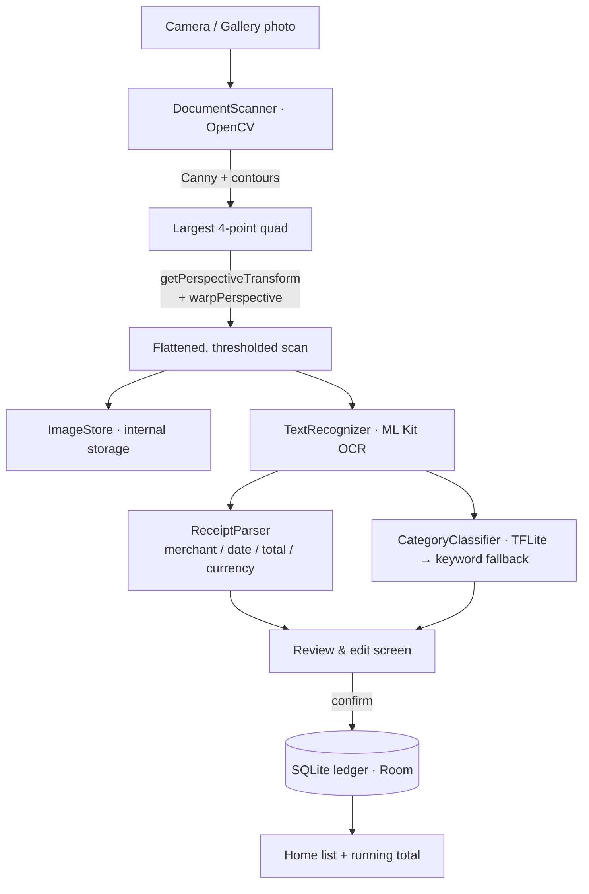

<div align="center">

# PocketScan

**Offline document scanner with on-device OCR — turns paper receipts into a searchable local ledger, without a single network call.**

Native **Android** flagship (Kotlin + Jetpack Compose + OpenCV + ML Kit + TensorFlow Lite)
· with an **iOS** parity target (Swift/SwiftUI + Vision) and an explicit Objective-C interop shim.

[Why](#why) · [Features](#features) · [How it works](#how-it-works) · [Run it](#running-the-android-app) · [Tech stack](#tech-stack) · [Tests](#tests)

</div>

---

## Why

Receipt scanners are a dime a dozen, but almost all of them ship your photos to
a cloud OCR endpoint. That is the wrong trade for something as sensitive as your
purchase history. **PocketScan does every step on the device:**

- edge detection + perspective correction,
- optical character recognition,
- receipt-field parsing, and
- spending categorization.

The app declares **no `INTERNET` permission at all** (see
[`AndroidManifest.xml`](app/src/main/AndroidManifest.xml)). Your receipts
physically cannot leave the phone. It is also **100% free and open source** —
no paid API, no subscription, no account.

## Features

- 📸 **Live camera scanning** with CameraX, plus **gallery import**.
- ✂️ **Automatic edge detection & perspective correction** via OpenCV
  (Canny → contour → quadrilateral → `warpPerspective`), then an adaptive
  threshold for a crisp, flattened "scanned" look.
- 🔤 **On-device OCR** using ML Kit's bundled Latin text recognizer
  (TensorFlow Lite under the hood) — no Play Services model download, no network.
- 🧾 **Receipt parsing** that pulls out **merchant, date, total, and currency**
  with robust heuristics: it ranks "grand total" over subtotals/tax and
  understands both `1,234.56` and `1.234,56` decimal conventions (US & EU/TR).
- 🏷️ **On-device spending categorization** with a TensorFlow Lite classifier
  that gracefully falls back to a transparent keyword model when no model is
  bundled.
- 💾 **Local SQLite ledger** (Room) with a live running total and per-receipt
  category — reactive via Kotlin `Flow`.
- 🔒 **Privacy by construction**: no internet permission, scans excluded from
  cloud backup.
- 🌍 **Bilingual-friendly parsing** — English and Turkish receipt keywords
  (`TOTAL`/`TOPLAM`, `TAX`/`KDV`, `₺`/`TL`) are recognized out of the box.

## How it works



Every box above runs locally. The dotted line to the network that most scanner
apps have simply does not exist here.

### Project layout

```
pocketscan/
├─ app/                       # Android flagship (Kotlin + Compose)
│  └─ src/main/java/dev/xj16/pocketscan/
│     ├─ vision/              # OpenCV: DocumentScanner, Quad, ScanPipeline
│     ├─ ocr/                 # ML Kit TextRecognizer + ReceiptParser
│     ├─ ml/                  # TensorFlow Lite CategoryClassifier (+ fallback)
│     ├─ data/               # Room: entity, DAO, database, repository
│     ├─ ui/                 # ViewModels + Compose screens
│     └─ util/               # ImageStore
├─ ios/                       # iOS parity target (Swift/SwiftUI + Vision)
│  └─ PocketScan/Interop/     # PSImageShim — explicit Objective-C shim
├─ scripts/                   # icon generator + optional TFLite training script
└─ .github/workflows/ci.yml   # Android + iOS CI
```

### Key files worth reading

| Concern                     | File |
|-----------------------------|------|
| Edge detect + perspective   | [`vision/DocumentScanner.kt`](app/src/main/java/dev/xj16/pocketscan/vision/DocumentScanner.kt) |
| Corner ordering (pure math) | [`vision/Quad.kt`](app/src/main/java/dev/xj16/pocketscan/vision/Quad.kt) |
| Receipt field parsing       | [`ocr/ReceiptParser.kt`](app/src/main/java/dev/xj16/pocketscan/ocr/ReceiptParser.kt) |
| On-device OCR               | [`ocr/TextRecognizer.kt`](app/src/main/java/dev/xj16/pocketscan/ocr/TextRecognizer.kt) |
| TFLite categorizer          | [`ml/CategoryClassifier.kt`](app/src/main/java/dev/xj16/pocketscan/ml/CategoryClassifier.kt) |
| Local ledger schema         | [`data/ReceiptEntity.kt`](app/src/main/java/dev/xj16/pocketscan/data/ReceiptEntity.kt) |

## Running the Android app

**Requirements:** JDK 17, the Android SDK (API 34), and a device/emulator on
API 24+. No API keys, ever.

```bash
git clone https://github.com/xj16/pocketscan.git
cd pocketscan

# Run the unit tests (pure JVM — fast):
./gradlew testDebugUnitTest

# Build the debug APK:
./gradlew assembleDebug
# → app/build/outputs/apk/debug/app-debug.apk

# Or open the folder in Android Studio and hit Run.
```

The first Gradle run downloads dependencies (OpenCV, ML Kit, TensorFlow Lite,
Compose). Everything comes from public Maven — no credentials needed.

### Optional: train the category model

Out of the box the categorizer uses a keyword fallback. To plug in a real
TensorFlow model (same 128-dim hashing features the app computes):

```bash
pip install "tensorflow>=2.15"
python scripts/train_category_model.py --out app/src/main/assets/receipt_category.tflite
```

See [`app/src/main/assets/README.md`](app/src/main/assets/README.md).

## The iOS parity target

`ios/` contains a **SwiftUI** app that mirrors the ledger + OCR experience using
Apple's **Vision** framework for on-device text recognition and **`libsqlite3`**
for storage. It includes a **thin, clearly-labeled Objective-C interop shim**
([`PSImageShim`](ios/PocketScan/Interop/PSImageShim.h)) that does a small Core
Graphics preprocessing pass before Vision runs — demonstrating real Swift ↔
Objective-C bridging.

> **Scope, stated plainly:** Android is the complete flagship. The iOS target
> ships parity for OCR → parse → ledger and the interop shim, but does **not**
> reimplement the OpenCV edge-detection/perspective pipeline. See
> [`ios/README.md`](ios/README.md).

Build it with [XcodeGen](https://github.com/yonaskolb/XcodeGen):

```bash
cd ios && xcodegen generate && open PocketScan.xcodeproj
```

## Tech stack

| Area            | Android (flagship)                              | iOS (parity)                        |
|-----------------|-------------------------------------------------|-------------------------------------|
| Language        | **Kotlin**                                       | **Swift**, **Objective-C** (shim)   |
| UI              | Jetpack Compose (Material 3)                     | SwiftUI                             |
| Computer vision | **OpenCV** (edge detect + perspective warp)      | Core Graphics (shim)               |
| OCR             | ML Kit text recognition (**TensorFlow** Lite)    | Apple Vision                        |
| ML              | **TensorFlow** Lite categorizer                  | keyword categorizer                 |
| Storage         | Room / **SQLite**                                | `libsqlite3` / **SQLite**           |
| Camera          | CameraX                                          | PhotosPicker                        |
| Build / CI      | Gradle · **GitHub Actions**                      | XcodeGen · **GitHub Actions**       |

## Tests

- **Android (JVM/Robolectric):** `ReceiptParserTest`, `QuadTest`,
  `CategoryClassifierTest` — parsing heuristics (US & EU/TR money formats,
  total-vs-subtotal ranking), quad corner ordering + target sizing, and the
  keyword classifier + feature vectorizer. Run with `./gradlew testDebugUnitTest`.
- **iOS (XCTest):** `ReceiptParserTests` (mirrors the Android cases so both
  platforms behave identically) and `LedgerStoreTests` (SQLite round-trip).

Both suites run in [CI](.github/workflows/ci.yml) on every push and PR.

## Privacy

- **No `INTERNET` permission** is declared by the Android app.
- OCR models are **bundled**, not downloaded.
- Scan images live in app-internal storage and are **excluded from cloud
  backups** ([`backup_rules.xml`](app/src/main/res/xml/backup_rules.xml)).

## License

[MIT](LICENSE) © 2026 xj16
