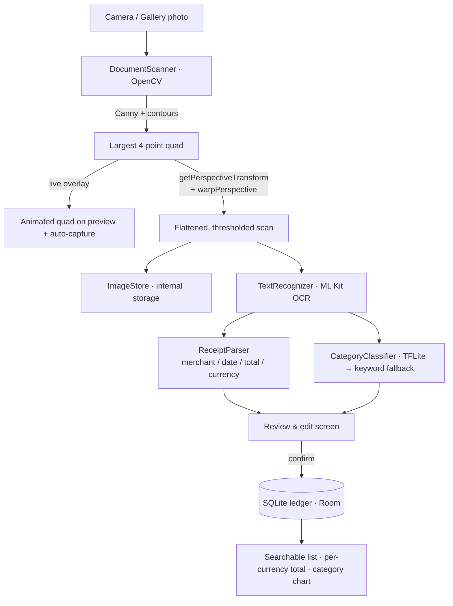

<div align="center">

# PocketScan

**An offline document scanner that turns paper receipts into a searchable,
private spending ledger — with zero network calls.**

Native **Android** flagship (Kotlin · Jetpack Compose · OpenCV · ML Kit · TensorFlow Lite)
· **iOS** parity target (Swift/SwiftUI · Vision) with an explicit Objective-C interop shim.

[](https://github.com/xj16/pocketscan/actions/workflows/ci.yml)
[](https://github.com/xj16/pocketscan/actions/workflows/pages.yml)
[](LICENSE)
[](https://xj16.github.io/pocketscan/)

[Why](#why) · [Features](#features) · [Live demo](#live-demo) · [How it works](#how-it-works) · [Run it](#running-the-android-app) · [Tests](#tests--coverage) · [Tech stack](#tech-stack)

</div>

---

## Why

Receipt scanners are a dime a dozen, but almost all of them ship your photos to
a cloud OCR endpoint. That is the wrong trade for something as sensitive as your
purchase history. **PocketScan does every step on the device:**

- edge detection + perspective correction,
- optical character recognition,
- receipt-field parsing, and
- spending categorization.

The Android app declares **no `INTERNET` permission at all** (see
[`AndroidManifest.xml`](app/src/main/AndroidManifest.xml)). Your receipts
physically cannot leave the phone. It is also **100% free and open source** —
no paid API, no subscription, no account.

## Features

- 📸 **Live camera scanning** with CameraX, plus **gallery import**.
- 🟩 **Real-time edge-detection overlay.** An `ImageAnalysis` stream runs OpenCV
  edge detection off the main thread and draws the detected document as an
  animated quad over the preview — with **auto-capture** once it's held steady.
- ✂️ **Automatic perspective correction** (Canny → contour → quadrilateral →
  `warpPerspective`), then an adaptive threshold for a crisp, flattened
  "scanned" look.
- 🔤 **On-device OCR** using ML Kit's bundled Latin text recognizer
  (TensorFlow Lite under the hood) — no model download, no network.
- 🧾 **Receipt parsing** that pulls out **merchant, date, total, and currency**
  with robust heuristics: it ranks "grand total" over subtotals/tax and reads
  both `1,234.56` and `1.234,56` decimal conventions (US & EU/TR). Accuracy is
  measured by a [golden-corpus benchmark](#tests--coverage).
- 🔎 **Searchable, filterable ledger** — search across merchant **and** raw OCR
  text, filter by category chips, all reactive via Kotlin `Flow`.
- 💱 **Honest mixed-currency totals** — a ledger mixing USD/TRY/EUR shows a
  per-currency breakdown (`$142.10 · ₺980.00`), never a nonsensical single sum.
- 📊 **Spending-by-category chart** drawn with a dependency-free Compose
  `Canvas` donut + legend.
- 🧷 **Receipt detail screen** with the cropped scan, parsed fields, raw text,
  and **share / delete** actions.
- 📤 **CSV export** of the whole ledger through the system share sheet.
- 🏷️ **On-device categorization** with a TensorFlow Lite classifier that falls
  back to a transparent keyword model when no model is bundled.
- 🔒 **Privacy by construction**: no internet permission, scans excluded from
  cloud backup.
- 🌍 **Bilingual-friendly parsing** — English and Turkish keywords
  (`TOTAL`/`TOPLAM`, `TAX`/`KDV`, `₺`/`TL`) recognized out of the box.

## Live demo

**→ [xj16.github.io/pocketscan](https://xj16.github.io/pocketscan/)**

The single smartest part of the codebase — the heuristic `ReceiptParser` — has
**zero Android/OpenCV dependencies**, so it's ported line-for-line to JavaScript
and hosted as a static, dependency-free page. Paste any receipt (or pick a
US / TR / EU / messy-OCR sample) and watch merchant, date, total and currency
light up live, with the matched spans highlighted on the receipt itself.
Everything runs in your tab — nothing is uploaded.

The JS port is **parity-tested against the same JUnit and XCTest fixtures** the
mobile parsers use (`demo/test/`), so the playground provably behaves like the
on-device parser. Source: [`demo/`](demo/).

```bash
# Run the playground locally:
cd demo && npm run serve   # → http://localhost:4173
npm test                    # JS ⇄ Kotlin parity suite
```

## How it works



Every box above runs locally. The dotted line to the network that most scanner
apps have simply does not exist here.

### Architecture

PocketScan is a single-activity Compose app with a small, testable core and no
DI framework — manual wiring in [`PocketScanApp`](app/src/main/java/dev/xj16/pocketscan/PocketScanApp.kt)
is clearer at this size than Hilt. Layers:

- **`vision/`** — OpenCV pipeline. `DocumentScanner` does detection + warp +
  enhance; `Quad` holds the pure-Kotlin corner-ordering / target-size math kept
  free of OpenCV types so it's JVM-unit-testable.
- **`ocr/`** — `TextRecognizer` (ML Kit) and the pure, offline `ReceiptParser`.
- **`ml/`** — `CategoryClassifier` (TFLite with a keyword fallback + hashing
  vectorizer).
- **`data/`** — Room entity, DAO (search + aggregates), database, repository.
  ViewModels depend only on the repository, so they test against a fake DAO.
- **`ui/`** — `HomeViewModel` / `ScanViewModel` / `ReceiptDetailViewModel` drive
  Compose screens; UI state is a single immutable `data class` per screen.
- **`util/`** — `ImageStore`, `LedgerCsv` (pure), `LedgerExporter`.

State flows one way: DAO → repository → ViewModel `StateFlow` → Compose. The
capture path runs entirely on background dispatchers.

### Project layout

```
pocketscan/
├─ app/                       # Android flagship (Kotlin + Compose)
│  └─ src/main/java/dev/xj16/pocketscan/
│     ├─ vision/              # OpenCV: DocumentScanner, Quad, ScanPipeline
│     ├─ ocr/                 # ML Kit TextRecognizer + ReceiptParser
│     ├─ ml/                  # TensorFlow Lite CategoryClassifier (+ fallback)
│     ├─ data/                # Room: entity, DAO, database, repository
│     ├─ ui/                  # ViewModels + Compose screens (+ SpendingChart)
│     └─ util/                # ImageStore, LedgerCsv, LedgerExporter
├─ demo/                      # Static in-browser ReceiptParser playground (JS)
├─ ios/                       # iOS parity target (Swift/SwiftUI + Vision)
├─ scripts/                   # icon generator, demo server, TFLite training
└─ .github/workflows/         # Android + iOS CI, Pages deploy
```

## Running the Android app

**Requirements:** JDK 17, the Android SDK (API 34), a device/emulator on
API 24+. No API keys, ever.

```bash
git clone https://github.com/xj16/pocketscan.git
cd pocketscan

# Unit tests + coverage (pure JVM / Robolectric — fast):
./gradlew jacocoTestReport
# → app/build/reports/jacoco/jacocoTestReport/html/index.html

# Build the debug APK:
./gradlew assembleDebug
# → app/build/outputs/apk/debug/app-debug.apk
```

The first Gradle run downloads dependencies (OpenCV, ML Kit, TensorFlow Lite,
Compose) from public Maven — no credentials needed.

### Optional: train the category model

Out of the box the categorizer uses a keyword fallback. To plug in a real model
(same 128-dim hashing features the app computes):

```bash
pip install "tensorflow>=2.15"
python scripts/train_category_model.py --out app/src/main/assets/receipt_category.tflite
```

See [`app/src/main/assets/README.md`](app/src/main/assets/README.md).

## The iOS parity target

`ios/` contains a **SwiftUI** app that mirrors the ledger + OCR experience using
Apple's **Vision** framework and **`libsqlite3`**. It includes a thin,
clearly-labeled Objective-C interop shim
([`PSImageShim`](ios/PocketScan/Interop/PSImageShim.h)) that does a small Core
Graphics preprocessing pass before Vision runs.

> **Scope, stated plainly:** Android is the complete flagship. The iOS target
> ships parity for OCR → parse → ledger and the interop shim, but does **not**
> reimplement the OpenCV edge-detection/perspective pipeline. See
> [`ios/README.md`](ios/README.md).

```bash
cd ios && xcodegen generate && open PocketScan.xcodeproj
```

## Tech stack

| Area            | Android (flagship)                              | iOS (parity)                        |
|-----------------|-------------------------------------------------|-------------------------------------|
| Language        | **Kotlin**                                       | **Swift**, **Objective-C** (shim)   |
| UI              | Jetpack Compose (Material 3)                     | SwiftUI                             |
| Computer vision | **OpenCV** (edge detect + perspective warp)      | Core Graphics (shim)                |
| OCR             | ML Kit text recognition (**TensorFlow** Lite)    | Apple Vision                        |
| ML              | **TensorFlow** Lite categorizer                  | keyword categorizer                 |
| Storage         | Room / **SQLite**                                | `libsqlite3` / **SQLite**           |
| Camera          | CameraX (Preview + Capture + Analysis)           | PhotosPicker                        |
| Charts          | dependency-free Compose `Canvas`                 | —                                   |
| Build / CI      | Gradle · JaCoCo · **GitHub Actions**             | XcodeGen · **GitHub Actions**       |

## Tests & coverage

- **Android (JVM/Robolectric):**
  - `ReceiptParserTest`, `GoldenCorpusTest` — parsing heuristics + a scored
    per-field accuracy benchmark over 14 anonymized US/EU/TR fixtures.
  - `ReceiptDaoTest` — Robolectric round-trip over the real Room DAO
    (insert / query / search / per-currency + per-category aggregates / delete).
  - `HomeViewModelTest` — currency grouping, search, category filter, chart
    slices (Turbine + coroutine test dispatcher, over a fake DAO).
  - `LedgerCsvTest`, `QuadTest`, `CategoryClassifierTest`.
  - Coverage via **JaCoCo**: `./gradlew jacocoTestReport` (uploaded as a CI
    artifact).
- **iOS (XCTest):** `ReceiptParserTests` (mirrors the Android cases) and
  `LedgerStoreTests` (SQLite round-trip).
- **Demo (Node):** `demo/test/parser.test.mjs` re-runs the JVM/XCTest fixtures
  against the JavaScript port to lock in parity.

All suites run in [CI](.github/workflows/ci.yml) on every push and PR.

## Privacy

- **No `INTERNET` permission** is declared by the Android app.
- OCR models are **bundled**, not downloaded.
- Scan images live in app-internal storage and are **excluded from cloud
  backups** ([`backup_rules.xml`](app/src/main/res/xml/backup_rules.xml)).
- CSV exports are written to the app cache and shared only through an explicit
  user action via a scoped `FileProvider`.

## License

[MIT](LICENSE) © 2026 xj16
